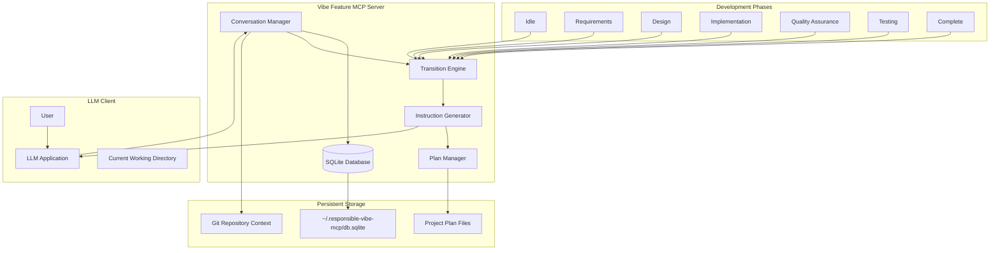
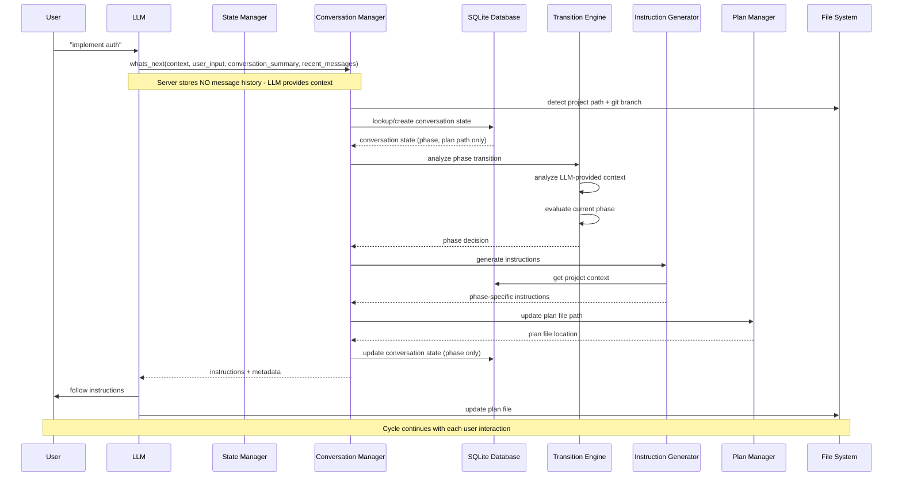
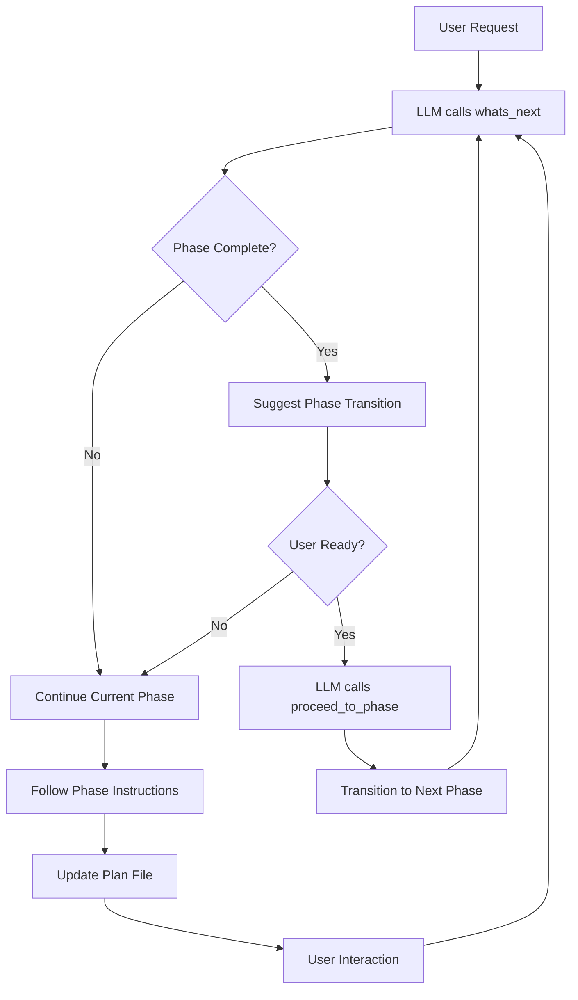
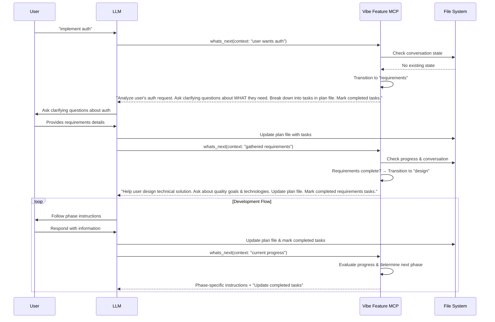

# Vibe Feature MCP Server

A Model Context Protocol (MCP) server that acts as an intelligent conversation state manager and development guide for LLMs. This server orchestrates feature development conversations by maintaining state, determining development phases, and providing contextual instructions to guide LLMs through structured development processes.

## Overview

**Vibe Feature MCP** serves as a conversation coordinator that:

- **Manages Conversation State**: Tracks development phase and conversation context across sessions
- **Guides LLM Behavior**: Provides phase-specific instructions telling the LLM what to do next
- **Maintains Project Memory**: Keeps a persistent markdown plan file that serves as long-term project memory
- **Orchestrates Development Flow**: Intelligently determines when to transition between development phases
- **Ensures Progress Tracking**: Continuously instructs the LLM to update completed tasks in the plan file

## Core Interaction Pattern

```
User: "implement auth"
  ↓
LLM: calls whats_next()
  ↓
Responsible-Vibe-MCP: analyzes context → determines phase → returns instructions
  ↓
LLM: follows instructions → interacts with user → updates plan file
  ↓
LLM: calls whats_next() again
  ↓
[cycle continues...]
```

## Architecture

### Static Architecture



### Core Building Blocks

#### 1. **Conversation Manager**
The Conversation Manager handles conversation identification, state persistence, and coordination between components.

**Responsibilities:**
- Generate unique conversation identifiers from project path + git branch
- Load and persist conversation state from/to database
- Coordinate state updates across components
- Handle conversation lifecycle (creation, updates, cleanup)
- Provide conversation-scoped state isolation
- Manage project-specific development context

**Key Features:**
- **Project-Aware Identification**: Uses absolute project path + current git branch as conversation identifier
- **Git Integration**: Automatically detects git branch changes and creates separate conversation contexts
- **Stateless Operation**: Does not store conversation history, relies on LLM-provided context
- **Multi-Project Support**: Handles multiple concurrent project conversations
- **State Validation**: Ensures state consistency and handles corrupted state recovery
- **Context Processing**: Analyzes LLM-provided conversation summary and recent messages

#### 2. **Transition Engine**
The Transition Engine manages the development state machine and determines appropriate phase transitions.

**Responsibilities:**
- Analyze user input and conversation context
- Determine current development phase
- Evaluate phase completion criteria
- Trigger phase transitions based on conversation analysis
- Implement development state machine logic

**Key Features:**
- **Context Analysis**: Processes LLM-provided conversation summary and recent messages
- **Phase Detection**: Intelligently determines appropriate development phase
- **Transition Logic**: Implements rules for phase progression and regression
- **Completion Assessment**: Evaluates when phases are sufficiently complete
- **State Machine Management**: Handles the core development workflow logic

#### 3. **Instruction Generator**
The Instruction Generator creates phase-specific guidance for the LLM based on current conversation state.

**Responsibilities:**
- Generate contextual instructions for each development phase
- Customize instructions based on project context and history
- Provide task completion guidance
- Generate plan file update instructions

**Key Features:**
- **Phase-Specific Guidance**: Tailored instructions for each development phase
- **Context-Aware Customization**: Adapts instructions based on project type and history
- **Task Management**: Provides clear guidance on task completion and progress tracking
- **Plan File Integration**: Ensures consistent plan file updates and maintenance

#### 4. **Plan Manager**
The Plan Manager handles the creation, updating, and maintenance of project development plan files.

**Responsibilities:**
- Generate and maintain markdown plan files
- Track task completion and progress
- Manage plan file structure and content
- Handle plan file versioning per git branch

**Key Features:**
- **Markdown Generation**: Creates structured development plans in markdown format
- **Progress Tracking**: Maintains task completion status and project progress
- **Branch-Aware Plans**: Separate plan files for different git branches when needed
- **Template Management**: Consistent plan file structure across projects

#### 5. **SQLite Database**
The database provides persistent storage for conversation state and metadata.

**Schema Design:**
- **conversation_states**: Core conversation metadata and current state
- **Indexes**: Optimized for project path + branch lookups

**Key Features:**
- **Persistent State**: Survives server restarts and system reboots
- **Multi-User Support**: Stored in user's home directory (~/.responsible-vibe-mcp/)
- **Lightweight Storage**: Minimal overhead for state management
- **Atomic Updates**: Ensures data consistency during concurrent operations

### Dynamic Behavior



### Data Flow Architecture

#### 1. **Conversation Identification Flow**
```
User Input → Project Detection → Git Branch Detection → Conversation ID Generation → Database Lookup
```

#### 2. **State Management Flow**
```
Conversation ID → State Retrieval → Context Analysis → Phase Determination → State Update → Persistence
```

#### 3. **Instruction Generation Flow**
```
Current Phase → Project Context → Conversation History → Instruction Template → Customized Instructions
```

#### 4. **Plan File Management Flow**
```
Project Path → Branch Detection → Plan File Path → Content Generation → File Updates → Progress Tracking
```

### Key Architectural Principles

#### 1. **Project-Centric Design**
- Each project maintains independent conversation state
- Git branch awareness enables feature-specific development tracking
- Plan files remain within project directories for easy access

#### 2. **Persistent State Management**
- SQLite database ensures state survives server restarts
- Conversation history enables context-aware decision making
- Database stored in user home directory for portability

#### 3. **Phase-Driven Workflow**
- Clear separation between development phases
- Phase-specific instructions guide LLM behavior
- Transition logic ensures appropriate workflow progression

#### 4. **Conversation Continuity**
- Long-term memory across multiple LLM interactions
- Context preservation enables complex, multi-session development
- History tracking supports learning and improvement

#### 5. **Git Integration**
- Branch-aware conversation management
- Separate development contexts for different features
- Integration with existing git workflows

### Scalability Considerations

#### 1. **Multi-Project Support**
- Concurrent handling of multiple project conversations
- Isolated state prevents cross-project interference
- Efficient database indexing for fast project lookups

#### 2. **Performance Optimization**
- SQLite provides fast local storage with minimal overhead
- Conversation state caching reduces database queries
- Efficient git branch detection minimizes system calls

#### 3. **Storage Management**
- Automatic cleanup of old conversation states
- Plan file management within project boundaries
- Database maintenance and optimization capabilities

### Integration Points

#### 1. **LLM Integration**
- Single `whats_next` tool interface
- JSON-based instruction delivery
- Context-aware response generation

#### 2. **File System Integration**
- Plan file creation and management
- Project directory detection
- Git repository integration

#### 3. **Development Tool Integration**
- Compatible with existing development workflows
- Non-intrusive plan file placement
- Standard markdown format for universal compatibility

## State Machine

The server operates as a state machine that transitions between development phases. While the diagram shows the typical linear progression, **users can transition directly to any phase at any time** using the `proceed_to_phase` tool

For a comprehensive reference of all state transitions, including detailed instructions and transition reasons, see [TRANSITIONS.md](./TRANSITIONS.md).

## Logging and Debugging

The server includes comprehensive logging with configurable levels for debugging, monitoring, and troubleshooting:

### Log Levels
- **DEBUG**: Detailed tracing and execution flow
- **INFO**: Success operations and important milestones (default)
- **WARN**: Expected errors and recoverable issues  
- **ERROR**: Caught but unexpected errors

### Configuration
Set the log level using the `LOG_LEVEL` environment variable:

```bash
# Debug level (most verbose)
LOG_LEVEL=DEBUG npx tsx src/index.ts

# Production level
LOG_LEVEL=INFO node dist/index.js
```

### Log Components
- **Server**: Main server operations and tool handlers
- **Database**: SQLite operations and state persistence
- **ConversationManager**: Conversation context management
- **TransitionEngine**: Phase transition analysis
- **PlanManager**: Plan file operations

For detailed logging documentation, see [LOGGING.md](./LOGGING.md).

## Features

### 1. Intelligent Phase Management

The server manages five core development phases, each with specific guidance:

#### Requirements Analysis
- Instructs LLM to analyze user requests and clarify the WHAT
- Guides the LLM to ask clarifying questions about functionality
- Directs the LLM to break down needs into specific tasks
- Ensures the LLM continuously marks completed requirements tasks

#### Design
- Instructs LLM to help user design technical solutions (the HOW)
- Guides the LLM to ask about quality goals and technology preferences
- Directs the LLM to document architectural decisions
- Ensures the LLM marks completed design tasks and updates plan

#### Implementation
- Instructs LLM to guide code implementation following best practices
- Guides the LLM to help with coding standards and structure
- Directs the LLM to track implementation progress
- Ensures the LLM marks completed implementation tasks

#### Quality Assurance
- Instructs LLM to guide code review and quality validation
- Guides the LLM to ensure requirements are properly met
- Directs the LLM to help with testing and documentation
- Ensures the LLM marks completed QA tasks

#### Testing
- Instructs LLM to guide comprehensive testing strategies
- Guides the LLM to help create and execute test plans
- Directs the LLM to validate feature completeness
- Ensures the LLM marks completed testing tasks

### 2. Conversation State Persistence

- **Phase Tracking**: Current development phase and transition history
- **Context Memory**: Conversation context and progress indicators
- **Plan Synchronization**: Ensures plan file stays updated with latest progress

### 3. Dynamic Plan Management

The server ensures the LLM maintains a living development plan document:

- **Project Overview**: Feature goals, scope, and current status
- **Phase Progress**: Tasks, deliverables, and completion status
- **Decision Log**: Important technical and design decisions
- **Timeline**: Progress tracking and milestone completion

## Development Workflow

### Starting Development

Development must be explicitly initiated using the `start_development` tool, which allows users to select their preferred workflow:

```
start_development({ workflow: "waterfall" })
```

Available workflows include:
- **waterfall**: Classical waterfall development process (default)
- **agile**: Iterative development with sprint cycles
- **custom**: Custom workflow defined in `.vibe/state-machine.yaml`

> **Important**: The `start_development` tool must be called before any other tools (`whats_next`, `proceed_to_phase`, `resume_workflow`). This ensures that development follows a deliberate workflow selection process.

## Phase Progression Flow

### How Users Advance Through Development Phases

After development has been started, the responsible-vibe-mcp server guides users through a structured development process using a two-tool approach that gives users full control over phase transitions:

#### 1. **Continuous Guidance with `whats_next`**
- LLM calls `whats_next()` after each user interaction
- Server analyzes current phase progress and plan file status
- Returns phase-specific instructions for what to do next

#### 2. **Explicit Phase Transitions with `proceed_to_phase`**
- When all tasks in a phase are complete, `whats_next()` suggests moving forward
- LLM uses `proceed_to_phase()` to explicitly transition to the next phase
- User maintains full control over pacing and can choose to refine current phase

### Phase Progression Pattern



### Example Phase Progression

#### Starting a New Feature
```
User: "I want to implement user authentication"
LLM: *calls whats_next()*
responsible-vibe-mcp: "New feature detected. Starting requirements analysis. Ask the user clarifying questions about WHAT they need for authentication..."
```

#### Working Within a Phase
```
LLM: *asks clarifying questions, updates plan file*
LLM: *calls whats_next()*
responsible-vibe-mcp: "Continue requirements gathering. You still need to clarify password policies and session management..."
```

#### Completing a Phase
```
LLM: *completes all requirements tasks*
LLM: *calls whats_next()*
responsible-vibe-mcp: "All requirements tasks are complete! ✅ You can proceed to design phase using 'proceed_to_phase' tool, or continue refining requirements if needed."
```

#### Transitioning to Next Phase
```
LLM: "Great! We've covered all authentication requirements. Let's move to design."
LLM: *calls proceed_to_phase(target_phase: "design", reason: "requirements complete")*
responsible-vibe-mcp: "Transitioning to design phase. Help the user design the technical solution. Ask about architecture, technologies, and quality goals..."
```

### Phase Completion Indicators

Each phase is considered complete when:

- **Requirements**: All user needs documented, scope confirmed, tasks broken down
- **Design**: Technical approach defined, architecture decided, technology choices made
- **Implementation**: Core functionality built, code structured, basic testing done
- **Quality Assurance**: Code reviewed, requirements validated, documentation complete
- **Testing**: Test plans executed, coverage verified, feature validated

### Refinement and Flexibility

Users can always choose to:
- **Stay in current phase**: Even when "complete," users can add more tasks or refine existing work
- **Go back**: Use `proceed_to_phase` to return to earlier phases if issues are discovered
- **Skip ahead**: In rare cases, jump to later phases if earlier work is already done

This approach ensures users maintain full control over the development process while receiving structured guidance from responsible-vibe-mcp.

## API Reference

### Resources

#### `development-plan`
- **URI**: `plan://current`
- **Description**: Current development plan document (markdown)
- **Updates**: Continuously updated by LLM based on server instructions

#### `conversation-state`
- **URI**: `state://current`
- **Description**: Current conversation state and phase information
- **Format**: JSON with phase, progress, and transition history

### Tools

#### `whats_next`
The primary tool that analyzes conversation state and provides LLM instructions.

**Parameters:**
- `context` (string, optional): Additional context about current conversation
- `user_input` (string, optional): Latest user input for analysis
- `conversation_summary` (string, optional): LLM-provided summary of the conversation so far
- `recent_messages` (array, optional): Array of recent conversation messages that LLM considers relevant

**Returns:**
- `phase` (string): Current development phase
- `instructions` (string): Detailed instructions for the LLM
- `plan_file_path` (string): Path to the plan file to update
- `transition_reason` (string): Why this phase was chosen
- `completed_tasks` (array): Tasks that should be marked as complete

#### `proceed_to_phase`
Tool for explicitly transitioning to a new development phase when current phase is complete.

**Parameters:**
- `target_phase` (string): The phase to transition to (requirements, design, implementation, qa, testing, complete)
- `reason` (string, optional): Reason for transitioning now

**Returns:**
- `phase` (string): New development phase
- `instructions` (string): Instructions for the new phase
- `plan_file_path` (string): Path to the plan file to update
- `transition_reason` (string): Confirmation of phase transition

#### `resume_workflow`
Tool for resuming development workflow after conversation compression. Returns comprehensive project context, current state, system prompt instructions, and next steps to seamlessly continue development.

**Parameters:**
- `include_system_prompt` (boolean, optional): Whether to include system prompt instructions (default: true)
- `simple_prompt` (boolean, optional): Whether to use simplified system prompt when included (default: true)

**Returns:**
- `workflow_status`: Current conversation and project state information
  - `conversation_id`: Unique conversation identifier
  - `current_phase`: Current development phase from database
  - `project_path`: Absolute project path
  - `git_branch`: Current git branch
  - `state_machine`: State machine information and available phases
- `plan_status`: Plan file analysis and status
  - `exists`: Whether plan file exists
  - `path`: Path to plan file
  - `analysis`: Extracted tasks, decisions, and progress (if file exists)
- `system_prompt`: Complete system prompt instructions (if requested)
- `recommendations`: Phase-specific next steps and guidance
  - `immediate_actions`: Recommended next actions
  - `phase_guidance`: Current phase-specific guidance
  - `potential_issues`: Potential issues to be aware of
- `generated_at`: Timestamp when response was generated
- `tool_version`: Tool version for compatibility tracking

**Usage:**
```javascript
// Get complete workflow resumption info (recommended)
resume_workflow()

// Get workflow info without system prompt
resume_workflow({ include_system_prompt: false })

// Get workflow info with verbose system prompt
resume_workflow({ simple_prompt: false })
```

**When to use:**
- **After conversation compression** when you need to re-establish development context
- **Starting new development sessions** to understand current project state
- **Debugging workflow issues** to see complete project context
- **Onboarding to existing projects** to understand current development status

#### `reset_development`
Tool for resetting conversation state and development progress. This permanently deletes conversation state and plan file, while soft-deleting interaction logs for audit trail.

**Parameters:**
- `confirm` (boolean, required): Must be true to execute reset - prevents accidental resets
- `reason` (string, optional): Optional reason for reset (for logging and audit trail)

**Returns:**
- `success` (boolean): Whether reset was successful
- `reset_items` (array): List of items that were deleted/reset
- `conversation_id` (string): The conversation that was reset
- `message` (string): Human-readable result message

**Reset Behavior:**
- **Hard deletes** current conversation state from database (fresh start)
- **Soft deletes** interaction logs (marks as reset with timestamp for audit trail)
- **Hard deletes** the plan file for the current conversation (clean slate)
- Provides clean slate for fresh development start while maintaining reset history

**Usage:**
```javascript
// Reset development with confirmation
reset_development({ confirm: true })

// Reset with reason for audit trail
reset_development({ 
  confirm: true, 
  reason: "Starting new feature approach" 
})
```

**When to use:**
- **Starting over** when current development direction isn't working
- **Switching approaches** when you want to try a completely different solution
- **Cleaning up** after experimental or exploratory development
- **Fresh start** when conversation state becomes too complex or confusing

**Safety Features:**
- Requires explicit `confirm: true` parameter to prevent accidental execution
- Maintains audit trail through soft-deleted interaction logs
- Comprehensive logging of all reset operations
- Clear feedback about what was reset

### Prompts

#### `phase-guidance`
Provides detailed guidance prompts for specific development phases.

**Arguments:**
- `phase` (string): Development phase name
- `context` (string): Additional context or specific questions

## Comprehensive Sample Interaction Flow

### Overview



### Dialogue in Detail

```
User: "I need to implement user authentication for my web app"

LLM: *calls whats_next(context: "user wants auth", user_input: "implement user authentication")*

Responsible-Vibe-MCP Response:
{
  "phase": "requirements",
  "instructions": "Analyze the user's authentication request. Ask clarifying questions about WHAT they need: What type of authentication? What user data? What security requirements? Break down their needs into specific tasks and add them to the development plan file at ./auth-feature-plan.md. Mark any completed requirements tasks as you progress.",
  "plan_file_path": "./auth-feature-plan.md",
  "transition_reason": "New feature request detected, starting requirements analysis",
  "completed_tasks": []
}

LLM: "I'll help you implement authentication! Let me understand your requirements better:

1. What type of authentication do you need? (email/password, social login, multi-factor?)
2. What user information do you want to store?
3. Do you have any specific security requirements?
4. What's your current tech stack?

*[Creates ./auth-feature-plan.md with initial authentication tasks]*"

User: "I need email/password auth with optional Google login. Store email, name, and profile picture. Using React frontend with Node.js backend."

LLM: *calls whats_next(context: "user clarified basic auth requirements", user_input: "email/password + Google, React/Node stack", conversation_summary: "User wants to implement authentication for web app, clarified basic requirements")*

Responsible-Vibe-MCP Response:
{
  "phase": "requirements", 
  "instructions": "Continue gathering requirements. Ask about password policies, session management, user roles, forgot password flow, data validation. Update the plan file with detailed requirements. Mark basic requirements gathering as complete.",
  "plan_file_path": "./auth-feature-plan.md",
  "transition_reason": "Still in requirements phase, need more details",
  "completed_tasks": ["basic_auth_type_identified", "tech_stack_confirmed"]
}

LLM: "Great! Let me gather a few more details:

1. Any password complexity requirements?
2. How long should user sessions last?
3. Do you need user roles/permissions?
4. Need forgot password functionality?
5. Any specific validation rules for user data?

*[Updates plan file marking basic requirements as complete, adds detailed requirement tasks]*"

User: "Standard password rules, 24-hour sessions, just basic user role for now, yes to forgot password, standard email validation."

LLM: *calls whats_next(context: "requirements seem complete", user_input: "password rules, 24h sessions, basic roles, forgot password, email validation")*

Responsible-Vibe-MCP Response:
{
  "phase": "requirements",
  "instructions": "All requirements tasks are complete! ✅ You have documented: authentication type, user data, security requirements, tech stack, password policies, session management, user roles, and forgot password flow. You can proceed to design phase using 'proceed_to_phase' tool, or continue refining requirements if needed.",
  "plan_file_path": "./auth-feature-plan.md", 
  "transition_reason": "All requirements tasks completed",
  "completed_tasks": ["requirements_documented", "user_confirmed_scope", "security_requirements_defined", "technical_constraints_identified"]
}

LLM: "Perfect! We've covered all the authentication requirements comprehensively. Let's move to the design phase."

LLM: *calls proceed_to_phase(target_phase: "design", reason: "requirements complete")*

Responsible-Vibe-MCP Response:
{
  "phase": "design",
  "instructions": "Help the user design the technical solution. Ask about database schema, API endpoints, security measures (JWT, bcrypt), third-party services for Google auth, error handling strategies. Ask about quality goals and specific technologies they prefer. Update the plan file with design decisions and mark completed requirements tasks as done.",
  "plan_file_path": "./auth-feature-plan.md",
  "transition_reason": "Explicit transition to design phase",
  "completed_tasks": []
}

LLM: "Perfect! Now let's design the technical solution:

**Database Design:**
- Users table: id, email, password_hash, name, profile_picture, google_id, role, created_at
- Sessions table: id, user_id, token, expires_at

**API Endpoints:**
- POST /auth/register
- POST /auth/login  
- POST /auth/google
- POST /auth/forgot-password
- POST /auth/reset-password
- GET /auth/me
- POST /auth/logout

**Security Measures:**
- JWT tokens for session management
- bcrypt for password hashing
- Input validation and sanitization

Do you approve this design? Any changes needed?

*[Updates plan file with design details, marks requirements tasks as complete]*"

User: "Yes, looks good. Let's implement it."

LLM: *calls whats_next(context: "design approved by user", user_input: "approved design, ready to implement")*

Responsible-Vibe-MCP Response:
{
  "phase": "design",
  "instructions": "All design tasks are complete! ✅ You have defined the architecture, database schema, API endpoints, and security measures. You can proceed to implementation phase using 'proceed_to_phase' tool, or continue refining the design if needed.",
  "plan_file_path": "./auth-feature-plan.md",
  "transition_reason": "All design tasks completed",
  "completed_tasks": ["architecture_defined", "database_schema_designed", "api_endpoints_planned", "security_measures_defined"]
}

LLM: "Excellent! The design is solid and approved. Let's move to implementation."

LLM: *calls proceed_to_phase(target_phase: "implementation", reason: "design complete and approved")*

Responsible-Vibe-MCP Response:
{
  "phase": "implementation",
  "instructions": "Guide the user through implementing the authentication system. Start with backend setup (user model, middleware, API endpoints), then frontend components. Follow coding best practices, include proper error handling, and write basic tests. Update the plan file with implementation progress and mark completed design tasks.",
  "plan_file_path": "./auth-feature-plan.md",
  "transition_reason": "Explicit transition to implementation phase",
  "completed_tasks": []
}

LLM: "Let's implement this step by step:

**Step 1: Backend Setup**
First, let's set up the user model and authentication middleware...

```javascript
// User model
const userSchema = new mongoose.Schema({
  email: { type: String, required: true, unique: true },
  password_hash: { type: String, required: true },
  name: { type: String, required: true },
  profile_picture: String,
  google_id: String,
  role: { type: String, default: 'user' }
});
```

**Step 2: JWT Middleware**
Here's the authentication middleware...

*[Continues with implementation guidance, updates plan file]*"

[Process continues through implementation, QA, and testing phases...]

## LLM System Prompt Integration

To properly integrate with responsible-vibe-mcp, the LLM should be configured with a system prompt that establishes the interaction pattern. The key requirement for the stateless approach is that the LLM must provide conversation context when calling `whats_next()`.

### Key Requirements for LLM Integration:

1. **Always call whats_next() after user interactions**
2. **Provide conversation context**: Include summary and recent messages
3. **Follow instructions precisely** from responsible-vibe-mcp
4. **Continuously update the plan file** as instructed
5. **Mark completed tasks** when directed

### Conversation Context Parameters:

When calling `whats_next()`, the LLM should provide:
- **context**: Brief description of current situation
- **user_input**: The user's latest message or request  
- **conversation_summary**: Summary of the conversation so far (optional but recommended)
- **recent_messages**: Array of recent relevant messages (optional)

This stateless approach ensures that responsible-vibe-mcp can make informed decisions about phase transitions without storing potentially inconsistent conversation history.

For a complete system prompt template, see [SYSTEM_PROMPT.md](./SYSTEM_PROMPT.md).

## Interaction Logging

Vibe Feature MCP includes a comprehensive interaction logging system that records all tool calls and responses for debugging and analysis purposes:

### Logged Information

- **Tool Calls**: All calls to `whats_next` and `proceed_to_phase` tools
- **Input Parameters**: Complete request parameters for each tool call
- **Response Data**: Complete response data returned to the LLM
- **Current Phase**: Development phase at the time of the interaction
- **Timestamp**: When the interaction occurred
- **Conversation ID**: Which conversation the interaction belongs to

### Data Storage

All interaction logs are stored in the local SQLite database in the `.vibe` directory of your project. The data is stored without masking or filtering, as it is kept locally on your system.

### Querying Logs

Logs can be queried by conversation ID for analysis and debugging purposes. No UI is provided in the current implementation, but the database can be accessed directly using SQLite tools.

**Note**: All interaction data is stored locally on your system and is never transmitted to external services.
