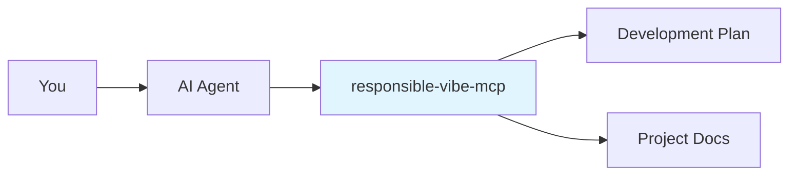

# Responsible Vibe MCP Server

[](https://github.com/mrsimpson/vibe-feature-mcp/actions/workflows/pr.yml)
[](https://github.com/mrsimpson/vibe-feature-mcp/actions/workflows/release.yml)
[](https://badge.fury.io/js/responsible-vibe-mcp)

An intelligent conversation coordinator for AI coding agents that provides structured development workflows through the Model Context Protocol (MCP).

## What is Responsible Vibe MCP?

**Responsible Vibe MCP** transforms your AI coding agent into a structured development partner that:

- **Guides Development Workflows**: Takes you through proven development phases (requirements → design → implementation → testing)
- **Maintains Project Memory**: Keeps track of decisions, progress, and context across conversations
- **Provides Phase-Specific Guidance**: Tells your AI exactly what to focus on at each development stage
- **Manages Project Documentation**: Creates and maintains architecture, requirements, and design documents

## Quick Start

### 🚀 **1-Command Setup**

Choose your AI coding agent and run the setup command:

```bash
# For Amazon Q CLI
npx responsible-vibe-mcp --generate-config amazonq-cli

# For Claude Code
npx responsible-vibe-mcp --generate-config claude

# For Gemini CLI
npx responsible-vibe-mcp --generate-config gemini

# For OpenCode CLI
npx responsible-vibe-mcp --generate-config opencode
```

This automatically creates all necessary configuration files with the correct system prompt and MCP server settings.

### ✅ **Verify Setup**

Start a conversation with your AI agent and ask:

> "Help me implement a new feature"

Your agent should automatically call MCP tools and guide you through a structured development process.

## How It Works



1. **You interact** with your AI coding agent normally
2. **AI agent calls** responsible-vibe-mcp tools automatically (via system prompt)
3. **MCP server provides** phase-specific guidance and maintains project context
4. **Development progresses** through structured workflows with persistent memory

## Example Development Flow

```
You: "I need user authentication for my app"

AI Agent: *calls whats_next() automatically*
↓
MCP Server: "Start requirements phase. Ask about auth type, user data, security needs..."
↓
AI Agent: "Let me understand your requirements:
1. What type of authentication? (email/password, social login, etc.)
2. What user information do you need to store?
3. Any specific security requirements?"

[Conversation continues through requirements → design → implementation → testing]
```

## Available Workflows

The system includes workflows organized by domain for better context management:

### Code Development Workflows (Default)

- **waterfall**: Full-featured development (requirements → design → implementation → QA → testing)
- **epcc**: Explore → Plan → Code → Commit (Anthropic's methodology)
- **bugfix**: Reproduce → Analyze → Fix → Verify
- **minor**: Streamlined for small changes
- **greenfield**: New projects from scratch
- **tdd**: Test-Driven Development workflow

### Architecture & Analysis Workflows

- **big-bang-conversion**: Complete system replacement with behavioral validation
- **boundary-testing**: System boundary and API testing
- **business-analysis**: Business capability modeling and analysis
- **c4-analysis**: Legacy system analysis using C4 methodology

### Office & Content Workflows

- **posts**: Blog post and content creation workflow
- **slides**: Presentation creation workflow

### Workflow Management

**Domain Filtering**: By default, only code development workflows are loaded to reduce context size. Control this with:

```bash
# Load all workflows
export VIBE_WORKFLOW_DOMAINS=code,architecture,office

# Load only specific domains
export VIBE_WORKFLOW_DOMAINS=code,architecture
```

**Install Workflows**: Add workflows to your project on-demand:

```bash
# Through your AI agent
"Install the posts workflow for content creation"
# This calls: install_workflow({ source: "posts" })
```

**Custom Workflows**: Create project-specific workflows in `.vibe/workflows/`:

- Override predefined workflows by using the same `name` in your YAML
- Custom workflows are always available regardless of domain filtering
- Use any filename - the `name` field in YAML determines the workflow identity

## Key Features

- **🧠 Long-Term Memory**: Project context survives across conversations and restarts
- **📋 Structured Workflows**: Proven development methodologies built-in
- **📚 Smart Documentation**: Auto-generates and maintains project docs
- **🔄 Phase Transitions**: Clear progression through development stages
- **🎯 Contextual Guidance**: AI gets specific instructions for each phase
- **🔧 Git Integration**: Optional automatic commits with configurable behavior
- **👥 Review System**: Optional quality gates before phase transitions

## Requirements

- **Node.js 18.0.0+**
- **AI Coding Agent** (Amazon Q, Claude, Gemini, etc.)
- **Git repository** (optional, for commit features)

## Manual Setup

If you prefer manual configuration:

### 1. Get System Prompt

```bash
npx responsible-vibe-mcp --system-prompt
```

### 2. Configure Your AI Agent

Add the system prompt to your AI agent's configuration.

### 3. Add MCP Server

Configure your agent to connect to `npx responsible-vibe-mcp`.

## Documentation

📖 **Complete documentation available at: https://mrsimpson.github.io/responsible-vibe-mcp/**

### Quick Links

- **[Getting Started](https://mrsimpson.github.io/responsible-vibe-mcp/user/agent-setup.html)** - Detailed setup for all agents
- **[How It Works](https://mrsimpson.github.io/responsible-vibe-mcp/user/how-it-works.html)** - Understanding the development flow
- **[Workflows](https://mrsimpson.github.io/responsible-vibe-mcp/workflows/)** - Available development methodologies
- **[Long-Term Memory](https://mrsimpson.github.io/responsible-vibe-mcp/user/long-term-memory.html)** - Project context and documentation system

## Troubleshooting

**Agent doesn't call MCP tools?**

- Verify system prompt is configured correctly
- Check MCP server connection in agent settings

**"Tool not found" errors?**

- Ensure `npx responsible-vibe-mcp` runs successfully
- Restart your agent/IDE after configuration

**Need help?**

- Check the [troubleshooting guide](https://mrsimpson.github.io/responsible-vibe-mcp/user/agent-setup.html#troubleshooting)
- Test with MCP Inspector: `npx @modelcontextprotocol/inspector`

## Contributing

This project uses conventional commits for version management:

```bash
# Install dependencies
npm install

# Run tests (always use --run flag)
npm run test:run

# Make changes with conventional commits
git commit -m "feat: add new feature"
git commit -m "fix: resolve issue"
```

See [development documentation](https://mrsimpson.github.io/responsible-vibe-mcp/dev/) for detailed contributor information.
