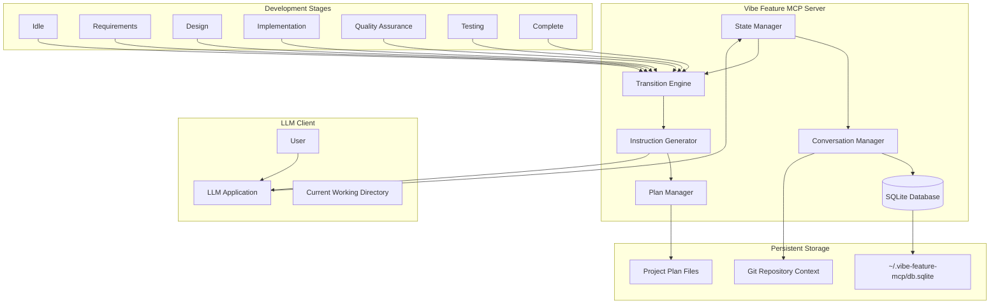
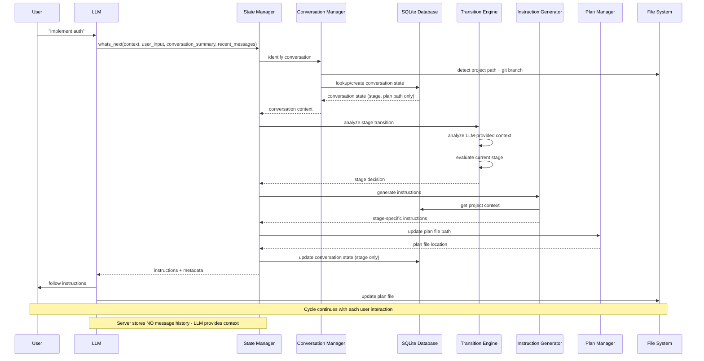

# Vibe Feature MCP Server

A Model Context Protocol (MCP) server that acts as an intelligent conversation state manager and development guide for LLMs. This server orchestrates feature development conversations by maintaining state, determining development stages, and providing contextual instructions to guide LLMs through structured development processes.

## Overview

**Vibe Feature MCP** serves as a conversation coordinator that:

- **Manages Conversation State**: Tracks development stage and conversation context across sessions
- **Guides LLM Behavior**: Provides stage-specific instructions telling the LLM what to do next
- **Maintains Project Memory**: Keeps a persistent markdown plan file that serves as long-term project memory
- **Orchestrates Development Flow**: Intelligently determines when to transition between development stages
- **Ensures Progress Tracking**: Continuously instructs the LLM to update completed tasks in the plan file

## Core Interaction Pattern

```
User: "implement auth"
  ↓
LLM: calls whats_next()
  ↓
Vibe-Feature-MCP: analyzes context → determines stage → returns instructions
  ↓
LLM: follows instructions → interacts with user → updates plan file
  ↓
LLM: calls whats_next() again
  ↓
[cycle continues...]
```

## Architecture

### Static Architecture



### Core Building Blocks

#### 1. **Conversation Manager**
The Conversation Manager is responsible for identifying and tracking unique development conversations across different projects and git branches.

**Responsibilities:**
- Generate unique conversation identifiers from project path + git branch
- Maintain conversation context and history
- Handle conversation lifecycle (creation, updates, cleanup)
- Provide conversation-scoped state isolation

**Key Features:**
- **Project-Aware Identification**: Uses absolute project path + current git branch as conversation identifier
- **Git Integration**: Automatically detects git branch changes and creates separate conversation contexts
- **Persistent Storage**: Stores conversation metadata in SQLite database
- **Context Isolation**: Each project/branch combination maintains independent state

#### 2. **State Manager**
The State Manager orchestrates the overall conversation state and coordinates between different components.

**Responsibilities:**
- Load and persist conversation state from/to database
- Coordinate state updates across components
- Handle state transitions and validation
- Manage project-specific development context

**Key Features:**
- **Stateless Operation**: Does not store conversation history, relies on LLM-provided context
- **Multi-Project Support**: Handles multiple concurrent project conversations
- **State Validation**: Ensures state consistency and handles corrupted state recovery
- **Context Processing**: Analyzes LLM-provided conversation summary and recent messages

#### 3. **Transition Engine**
The Transition Engine analyzes conversation context and determines appropriate stage transitions.

**Responsibilities:**
- Analyze user input and conversation context
- Determine current development stage
- Evaluate stage completion criteria
- Trigger stage transitions based on conversation analysis

**Key Features:**
- **Context Analysis**: Processes LLM-provided conversation summary and recent messages
- **Stage Detection**: Intelligently determines appropriate development stage
- **Transition Logic**: Implements rules for stage progression and regression
- **Completion Assessment**: Evaluates when stages are sufficiently complete

#### 4. **Instruction Generator**
The Instruction Generator creates stage-specific guidance for the LLM based on current conversation state.

**Responsibilities:**
- Generate contextual instructions for each development stage
- Customize instructions based on project context and history
- Provide task completion guidance
- Generate plan file update instructions

**Key Features:**
- **Stage-Specific Guidance**: Tailored instructions for each development phase
- **Context-Aware Customization**: Adapts instructions based on project type and history
- **Task Management**: Provides clear guidance on task completion and progress tracking
- **Plan File Integration**: Ensures consistent plan file updates and maintenance

#### 5. **Plan Manager**
The Plan Manager handles the creation, updating, and maintenance of project development plan files.

**Responsibilities:**
- Generate and maintain markdown plan files
- Track task completion and progress
- Manage plan file structure and content
- Handle plan file versioning per git branch

**Key Features:**
- **Markdown Generation**: Creates structured development plans in markdown format
- **Progress Tracking**: Maintains task completion status and project progress
- **Branch-Aware Plans**: Separate plan files for different git branches when needed
- **Template Management**: Consistent plan file structure across projects

#### 6. **SQLite Database**
The database provides persistent storage for conversation state and metadata.

**Schema Design:**
- **conversation_states**: Core conversation metadata and current state
- **Indexes**: Optimized for project path + branch lookups

**Key Features:**
- **Persistent State**: Survives server restarts and system reboots
- **Multi-User Support**: Stored in user's home directory (~/.vibe-feature-mcp/)
- **Lightweight Storage**: Minimal overhead for state management
- **Atomic Updates**: Ensures data consistency during concurrent operations

### Dynamic Behavior



### Data Flow Architecture

#### 1. **Conversation Identification Flow**
```
User Input → Project Detection → Git Branch Detection → Conversation ID Generation → Database Lookup
```

#### 2. **State Management Flow**
```
Conversation ID → State Retrieval → Context Analysis → Stage Determination → State Update → Persistence
```

#### 3. **Instruction Generation Flow**
```
Current Stage → Project Context → Conversation History → Instruction Template → Customized Instructions
```

#### 4. **Plan File Management Flow**
```
Project Path → Branch Detection → Plan File Path → Content Generation → File Updates → Progress Tracking
```

### Key Architectural Principles

#### 1. **Project-Centric Design**
- Each project maintains independent conversation state
- Git branch awareness enables feature-specific development tracking
- Plan files remain within project directories for easy access

#### 2. **Persistent State Management**
- SQLite database ensures state survives server restarts
- Conversation history enables context-aware decision making
- Database stored in user home directory for portability

#### 3. **Stage-Driven Workflow**
- Clear separation between development stages
- Stage-specific instructions guide LLM behavior
- Transition logic ensures appropriate workflow progression

#### 4. **Conversation Continuity**
- Long-term memory across multiple LLM interactions
- Context preservation enables complex, multi-session development
- History tracking supports learning and improvement

#### 5. **Git Integration**
- Branch-aware conversation management
- Separate development contexts for different features
- Integration with existing git workflows

### Scalability Considerations

#### 1. **Multi-Project Support**
- Concurrent handling of multiple project conversations
- Isolated state prevents cross-project interference
- Efficient database indexing for fast project lookups

#### 2. **Performance Optimization**
- SQLite provides fast local storage with minimal overhead
- Conversation state caching reduces database queries
- Efficient git branch detection minimizes system calls

#### 3. **Storage Management**
- Automatic cleanup of old conversation states
- Plan file management within project boundaries
- Database maintenance and optimization capabilities

### Integration Points

#### 1. **LLM Integration**
- Single `whats_next` tool interface
- JSON-based instruction delivery
- Context-aware response generation

#### 2. **File System Integration**
- Plan file creation and management
- Project directory detection
- Git repository integration

#### 3. **Development Tool Integration**
- Compatible with existing development workflows
- Non-intrusive plan file placement
- Standard markdown format for universal compatibility

### Dynamic Behavior


## State Machine

The server operates as a state machine that transitions between development stages based on conversation analysis:


## Features

### 1. Intelligent Stage Management

The server manages five core development stages, each with specific guidance:

#### Requirements Analysis
- Instructs LLM to analyze user requests and clarify the WHAT
- Guides the LLM to ask clarifying questions about functionality
- Directs the LLM to break down needs into specific tasks
- Ensures the LLM continuously marks completed requirements tasks

#### Design
- Instructs LLM to help user design technical solutions (the HOW)
- Guides the LLM to ask about quality goals and technology preferences
- Directs the LLM to document architectural decisions
- Ensures the LLM marks completed design tasks and updates plan

#### Implementation
- Instructs LLM to guide code implementation following best practices
- Guides the LLM to help with coding standards and structure
- Directs the LLM to track implementation progress
- Ensures the LLM marks completed implementation tasks

#### Quality Assurance
- Instructs LLM to guide code review and quality validation
- Guides the LLM to ensure requirements are properly met
- Directs the LLM to help with testing and documentation
- Ensures the LLM marks completed QA tasks

#### Testing
- Instructs LLM to guide comprehensive testing strategies
- Guides the LLM to help create and execute test plans
- Directs the LLM to validate feature completeness
- Ensures the LLM marks completed testing tasks

### 2. Conversation State Persistence

- **Stage Tracking**: Current development stage and transition history
- **Context Memory**: Conversation context and progress indicators
- **Plan Synchronization**: Ensures plan file stays updated with latest progress

### 3. Dynamic Plan Management

The server ensures the LLM maintains a living development plan document:

- **Project Overview**: Feature goals, scope, and current status
- **Stage Progress**: Tasks, deliverables, and completion status
- **Decision Log**: Important technical and design decisions
- **Timeline**: Progress tracking and milestone completion

## Installation

```bash
npm install @modelcontextprotocol/sdk zod
```

## Configuration

Create a configuration file `vibe-config.json`:

```json
{
  "projectName": "My Project",
  "planFilePath": "./feature-plan.md",
  "stateFilePath": "./conversation-state.json",
  "stageInstructions": {
    "requirements": "Analyze the user's request about the feature they want to implement. Ask clarifying questions about WHAT they need. Explore alternative approaches. Break down their needs into specific tasks and add them to the plan file. Mark completed requirements tasks as you progress.",
    "design": "Help the user design the technical solution. Ask about quality goals, technologies, architecture decisions. Document the HOW of implementation. Update the plan file with design decisions. Mark completed requirements tasks and add design tasks.",
    "implementation": "Guide the user through implementing the feature. Follow coding best practices, ensure proper error handling and testing. Update the plan file with implementation progress. Mark completed design tasks and track implementation tasks.",
    "qa": "Guide the user through quality assurance. Review code quality, validate requirements are met, ensure proper testing. Update the plan file with QA results. Mark completed implementation tasks.",
    "testing": "Guide the user through comprehensive testing. Create test plans, execute tests, validate feature completeness. Update the plan file with test results. Mark completed QA tasks."
  },
  "transitionCriteria": {
    "requirements_to_design": ["requirements_documented", "user_confirmed_scope"],
    "design_to_implementation": ["architecture_defined", "tech_stack_chosen"],
    "implementation_to_qa": ["core_functionality_complete", "basic_testing_done"],
    "qa_to_testing": ["code_reviewed", "requirements_validated"],
    "testing_to_complete": ["tests_passing", "feature_validated"]
  }
}
```

## API Reference

### Resources

#### `development-plan`
- **URI**: `plan://current`
- **Description**: Current development plan document (markdown)
- **Updates**: Continuously updated by LLM based on server instructions

#### `conversation-state`
- **URI**: `state://current`
- **Description**: Current conversation state and stage information
- **Format**: JSON with stage, progress, and transition history

### Tools

#### `whats_next`
The primary tool that analyzes conversation state and provides LLM instructions.

**Parameters:**
- `context` (string, optional): Additional context about current conversation
- `user_input` (string, optional): Latest user input for analysis
- `conversation_summary` (string, optional): LLM-provided summary of the conversation so far
- `recent_messages` (array, optional): Array of recent conversation messages that LLM considers relevant

**Returns:**
- `stage` (string): Current development stage
- `instructions` (string): Detailed instructions for the LLM
- `plan_file_path` (string): Path to the plan file to update
- `transition_reason` (string): Why this stage was chosen
- `completed_tasks` (array): Tasks that should be marked as complete

### Prompts

#### `stage-guidance`
Provides detailed guidance prompts for specific development stages.

**Arguments:**
- `stage` (string): Development stage name
- `context` (string): Additional context or specific questions

## Comprehensive Sample Interaction Flow

### Scenario: User wants to implement authentication

```
User: "I need to implement user authentication for my web app"

LLM: *calls whats_next(context: "user wants auth", user_input: "implement user authentication")*

Vibe-Feature-MCP Response:
{
  "stage": "requirements",
  "instructions": "Analyze the user's authentication request. Ask clarifying questions about WHAT they need: What type of authentication? What user data? What security requirements? Break down their needs into specific tasks and add them to the development plan file at ./auth-feature-plan.md. Mark any completed requirements tasks as you progress.",
  "plan_file_path": "./auth-feature-plan.md",
  "transition_reason": "New feature request detected, starting requirements analysis",
  "completed_tasks": []
}

LLM: "I'll help you implement authentication! Let me understand your requirements better:

1. What type of authentication do you need? (email/password, social login, multi-factor?)
2. What user information do you want to store?
3. Do you have any specific security requirements?
4. What's your current tech stack?

*[Creates ./auth-feature-plan.md with initial authentication tasks]*"

User: "I need email/password auth with optional Google login. Store email, name, and profile picture. Using React frontend with Node.js backend."

LLM: *calls whats_next(context: "user clarified basic auth requirements", user_input: "email/password + Google, React/Node stack", conversation_summary: "User wants to implement authentication for web app, clarified basic requirements")*

Vibe-Feature-MCP Response:
{
  "stage": "requirements", 
  "instructions": "Continue gathering requirements. Ask about password policies, session management, user roles, forgot password flow, data validation. Update the plan file with detailed requirements. Mark basic requirements gathering as complete.",
  "plan_file_path": "./auth-feature-plan.md",
  "transition_reason": "Still in requirements phase, need more details",
  "completed_tasks": ["basic_auth_type_identified", "tech_stack_confirmed"]
}

LLM: "Great! Let me gather a few more details:

1. Any password complexity requirements?
2. How long should user sessions last?
3. Do you need user roles/permissions?
4. Need forgot password functionality?
5. Any specific validation rules for user data?

*[Updates plan file marking basic requirements as complete, adds detailed requirement tasks]*"

User: "Standard password rules, 24-hour sessions, just basic user role for now, yes to forgot password, standard email validation."

LLM: *calls whats_next(context: "requirements seem complete", user_input: "password rules, 24h sessions, basic roles, forgot password, email validation")*

Vibe-Feature-MCP Response:
{
  "stage": "design",
  "instructions": "Help the user design the technical solution. Ask about database schema, API endpoints, security measures (JWT, bcrypt), third-party services for Google auth, error handling strategies. Ask about quality goals and specific technologies they prefer. Update the plan file with design decisions and mark completed requirements tasks as done.",
  "plan_file_path": "./auth-feature-plan.md", 
  "transition_reason": "Requirements complete, transitioning to design phase",
  "completed_tasks": ["requirements_documented", "user_confirmed_scope", "security_requirements_defined"]
}

LLM: "Perfect! Now let's design the technical solution:

**Database Design:**
- Users table: id, email, password_hash, name, profile_picture, google_id, role, created_at
- Sessions table: id, user_id, token, expires_at

**API Endpoints:**
- POST /auth/register
- POST /auth/login  
- POST /auth/google
- POST /auth/forgot-password
- POST /auth/reset-password
- GET /auth/me
- POST /auth/logout

**Security Measures:**
- JWT tokens for session management
- bcrypt for password hashing
- Input validation and sanitization

Do you approve this design? Any changes needed?

*[Updates plan file with design details, marks requirements tasks as complete]*"

User: "Yes, looks good. Let's implement it."

LLM: *calls whats_next(context: "design approved by user", user_input: "approved design, ready to implement")*

Vibe-Feature-MCP Response:
{
  "stage": "implementation",
  "instructions": "Guide the user through implementing the authentication system. Start with backend setup (user model, middleware, API endpoints), then frontend components. Follow coding best practices, include proper error handling, and write basic tests. Update the plan file with implementation progress and mark completed design tasks.",
  "plan_file_path": "./auth-feature-plan.md",
  "transition_reason": "Design approved, moving to implementation",
  "completed_tasks": ["architecture_defined", "database_schema_designed", "api_endpoints_planned"]
}

LLM: "Let's implement this step by step:

**Step 1: Backend Setup**
First, let's set up the user model and authentication middleware...

```javascript
// User model
const userSchema = new mongoose.Schema({
  email: { type: String, required: true, unique: true },
  password_hash: { type: String, required: true },
  name: { type: String, required: true },
  profile_picture: String,
  google_id: String,
  role: { type: String, default: 'user' }
});
```

**Step 2: JWT Middleware**
Here's the authentication middleware...

*[Continues with implementation guidance, updates plan file]*"

[Process continues through implementation, QA, and testing phases...]

## LLM System Prompt Integration

To properly integrate with vibe-feature-mcp, the LLM should be configured with a system prompt that establishes the interaction pattern. The key requirement for the stateless approach is that the LLM must provide conversation context when calling `whats_next()`.

### Key Requirements for LLM Integration:

1. **Always call whats_next() after user interactions**
2. **Provide conversation context**: Include summary and recent messages
3. **Follow instructions precisely** from vibe-feature-mcp
4. **Continuously update the plan file** as instructed
5. **Mark completed tasks** when directed

### Conversation Context Parameters:

When calling `whats_next()`, the LLM should provide:
- **context**: Brief description of current situation
- **user_input**: The user's latest message or request  
- **conversation_summary**: Summary of the conversation so far (optional but recommended)
- **recent_messages**: Array of recent relevant messages (optional)

This stateless approach ensures that vibe-feature-mcp can make informed decisions about stage transitions without storing potentially inconsistent conversation history.

For a complete system prompt template, see [SYSTEM_PROMPT.md](./SYSTEM_PROMPT.md).
