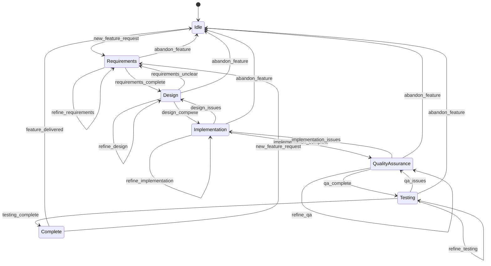

# State Transition Table

This document provides a comprehensive reference for all state transitions in the Vibe Feature MCP Server. Each transition defines the instructions returned to the LLM for guiding the user through the development process.

## Overview

## Legend

- **Modeled**: Transition is shown in the state diagram and gets contextual guidance
- **Direct**: Transition is not in the diagram but supported via `proceed_to_stage` tool

## Complete Transition Matrix

| From State | To State | Trigger | Type | Instructions | Transition Reason |
|------------|----------|---------|------|--------------|-------------------|
| **idle** | requirements | new_feature_request | Modeled | New feature request detected! Start requirements analysis by asking the user clarifying questions about WHAT they need. Focus on understanding their goals, scope, and constraints. Break down their needs into specific, actionable tasks and document them in the plan file. Mark completed requirements tasks as you progress. | New feature request detected, starting requirements analysis |
| **requirements** | requirements | refine_requirements | Modeled | Continue refining requirements. Ask more detailed questions to clarify scope, constraints, and user needs. Add any new requirements to the plan file and mark completed tasks. Ensure you have a complete understanding of WHAT needs to be built before moving to design. | Requirements need further refinement and clarification |
| **requirements** | design | requirements_complete | Modeled | Requirements are complete! ✅ Now transition to design phase. Help the user design the technical solution by asking about architecture, technologies, quality goals, and implementation approach. Focus on HOW to build what was defined in requirements. Document design decisions in the plan file and mark completed requirements tasks. | All requirements tasks completed, moving to technical design |
| **requirements** | idle | abandon_feature | Modeled | Feature development abandoned. Clean up any temporary work and return to idle state. The plan file will remain for future reference if the user wants to resume this feature later. | User decided to abandon this feature development |
| **design** | design | refine_design | Modeled | Continue refining the technical design. Ask about architecture details, technology choices, data models, API design, and quality considerations. Update the plan file with design decisions and mark completed design tasks. Ensure the design is solid before implementation. | Design needs further refinement and detail |
| **design** | requirements | requirements_unclear | Modeled | Design phase revealed unclear requirements. Return to requirements analysis to clarify the WHAT before continuing with HOW. Ask specific questions about the unclear aspects and update the plan file with refined requirements. | Design work revealed gaps or ambiguities in requirements |
| **design** | implementation | design_complete | Modeled | Design is complete! ✅ Now transition to implementation. Guide the user through building the solution following the design. Focus on coding best practices, proper structure, error handling, and basic testing. Update the plan file with implementation progress and mark completed design tasks. | Technical design is complete, ready to start building |
| **design** | idle | abandon_feature | Modeled | Feature development abandoned during design phase. Clean up any design artifacts and return to idle state. The plan file will remain for future reference. | User decided to abandon feature during design phase |
| **implementation** | implementation | refine_implementation | Modeled | Continue implementation work. Help with coding, debugging, structure improvements, and adding functionality. Follow best practices and ensure code quality. Update the plan file with progress and mark completed implementation tasks. | Implementation work continues, adding features or improving code |
| **implementation** | design | design_issues | Modeled | Implementation revealed issues with the design. Return to design phase to address architectural problems or design gaps. Analyze what's not working and revise the technical approach. Update the plan file with design changes. | Implementation work revealed problems with the current design |
| **implementation** | qa | implementation_complete | Modeled | Implementation is complete! ✅ Now transition to quality assurance. Review the code for quality, validate that requirements are properly met, check for bugs, and ensure documentation is complete. Update the plan file and mark completed implementation tasks. | Core implementation is complete, ready for quality review |
| **implementation** | idle | abandon_feature | Modeled | Feature development abandoned during implementation. Clean up any incomplete code and return to idle state. The plan file and any completed work will remain for future reference. | User decided to abandon feature during implementation |
| **qa** | qa | refine_qa | Modeled | Continue quality assurance work. Review code quality, validate requirements compliance, check for bugs, improve documentation, and ensure best practices are followed. Update the plan file with QA progress and mark completed tasks. | Quality assurance work continues, improving code quality |
| **qa** | implementation | implementation_issues | Modeled | Quality assurance revealed implementation issues. Return to implementation phase to fix bugs, improve code quality, or add missing functionality. Focus on addressing the specific issues identified during QA review. | QA review found issues that require implementation changes |
| **qa** | testing | qa_complete | Modeled | Quality assurance is complete! ✅ Now transition to testing phase. Create comprehensive test plans, write and execute tests, validate feature completeness, and ensure everything works as expected. Update the plan file and mark completed QA tasks. | Quality assurance is complete, ready for comprehensive testing |
| **qa** | idle | abandon_feature | Modeled | Feature development abandoned during QA phase. Clean up any QA artifacts and return to idle state. The plan file and completed work will remain for future reference. | User decided to abandon feature during quality assurance |
| **testing** | testing | refine_testing | Modeled | Continue testing work. Create more test cases, improve test coverage, run integration tests, and validate edge cases. Update the plan file with testing progress and mark completed testing tasks. | Testing work continues, improving coverage and validation |
| **testing** | qa | qa_issues | Modeled | Testing revealed quality issues. Return to QA phase to address code quality problems, documentation gaps, or requirement compliance issues identified during testing. Focus on the specific QA issues found. | Testing found issues that require quality assurance attention |
| **testing** | complete | testing_complete | Modeled | Testing is complete! ✅ The feature is fully implemented, tested, and ready for delivery. Transition to complete state. Summarize what was accomplished and prepare final documentation. Mark all testing tasks as complete. | All testing is complete, feature is ready for delivery |
| **testing** | idle | abandon_feature | Modeled | Feature development abandoned during testing phase. Clean up any testing artifacts and return to idle state. The plan file and completed work will remain for future reference. | User decided to abandon feature during testing phase |
| **complete** | idle | feature_delivered | Modeled | Feature has been delivered successfully! Return to idle state, ready for the next development task. The completed plan file serves as documentation of what was accomplished. | Feature delivery complete, returning to idle state |
| **complete** | requirements | new_feature_request | Modeled | New feature request while previous feature is complete. Start fresh requirements analysis for the new feature. Ask clarifying questions about what they need and create a new development plan. | New feature request received, starting new development cycle |

## Direct Stage Instructions

These instructions are used for direct transitions (not modeled in the state diagram) when users jump to any stage using `proceed_to_stage`:

| Target Stage | Instructions |
|--------------|--------------|
| **idle** | Returned to idle state. Ready to help with new feature development or other tasks. |
| **requirements** | Starting requirements analysis. Ask the user clarifying questions about WHAT they need. Focus on understanding their goals, scope, constraints, and success criteria. Break down their needs into specific, actionable tasks and document them in the plan file. Mark completed requirements tasks as you progress. |
| **design** | Starting design phase. Help the user design the technical solution by asking about architecture, technologies, data models, API design, and quality goals. Focus on HOW to build what was defined in requirements. Document design decisions in the plan file and update task completion status. |
| **implementation** | Starting implementation phase. Guide the user through building the solution following best practices. Focus on coding standards, proper structure, error handling, and basic testing. Update the plan file with implementation progress and mark completed tasks. |
| **qa** | Starting quality assurance phase. Review the code for quality, validate that requirements are properly met, check for bugs, and ensure documentation is complete. Update the plan file with QA findings and mark completed tasks. |
| **testing** | Starting testing phase. Create comprehensive test plans, write and execute tests, validate feature completeness, and ensure everything works as expected. Update the plan file with testing progress and mark completed tasks. |
| **complete** | Feature development is complete! Summarize what was accomplished and prepare final documentation. The feature is fully implemented, tested, and ready for delivery. |

## Stage Transition Flexibility

The Vibe Feature MCP server supports flexible transitions between any stages using the `proceed_to_stage` tool. While the state diagram shows the typical development flow, users can move directly to any stage based on their specific needs:

- **Forward progression**: Requirements → Design → Implementation → QA → Testing → Complete
- **Backward refinement**: When issues are discovered, return to earlier stages
- **Refinement loops**: Stay in current stage to add more work or improve quality
- **Direct transitions**: Jump to any stage based on specific project needs

For modeled transitions, the server provides contextual guidance about why the transition makes sense and what to focus on next. For direct transitions, it provides general stage instructions appropriate for the target stage.