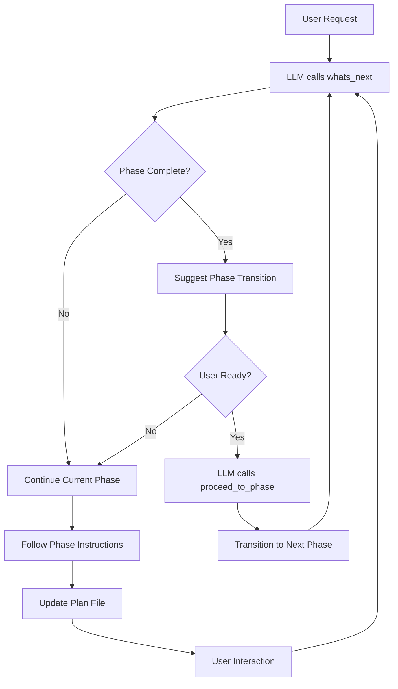
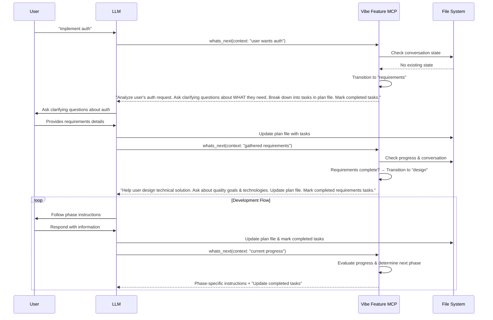

# Examples

This document provides comprehensive interaction examples and workflows for the Responsible Vibe MCP Server.

## Phase Progression Flow

### How Users Advance Through Development Phases

After development has been started, the responsible-vibe-mcp server guides users through a structured development process using a two-tool approach that gives users full control over phase transitions:

#### 1. **Continuous Guidance with `whats_next`**
- LLM calls `whats_next()` after each user interaction
- Server analyzes current phase progress and plan file status
- Returns phase-specific instructions for what to do right now

#### 2. **Explicit Phase Transitions with `proceed_to_phase`**
- When all tasks in a phase are complete, `whats_next()` suggests moving forward
- LLM uses `proceed_to_phase()` to explicitly transition to the next phase
- User maintains full control over pacing and can choose to refine current phase

### Phase Progression Pattern



### Example Phase Progression

#### Starting a New Feature
```
User: "I want to implement user authentication"
LLM: *calls whats_next()*
responsible-vibe-mcp: "New feature detected. Starting requirements analysis. Ask the user clarifying questions about WHAT they need for authentication..."
```

#### Working Within a Phase
```
LLM: *asks clarifying questions, updates plan file*
LLM: *calls whats_next()*
responsible-vibe-mcp: "Continue requirements gathering. You still need to clarify password policies and session management..."
```

#### Completing a Phase
```
LLM: *completes all requirements tasks*
LLM: *calls whats_next()*
responsible-vibe-mcp: "All requirements tasks are complete! ✅ You can proceed to design phase using 'proceed_to_phase' tool, or continue refining requirements if needed."
```

#### Transitioning to Next Phase
```
LLM: "Great! We've covered all authentication requirements. Let's move to design."
LLM: *calls proceed_to_phase(target_phase: "design", reason: "requirements complete")*
responsible-vibe-mcp: "Transitioning to design phase. Help the user design the technical solution. Ask about architecture, technologies, and quality goals..."
```

### Phase Completion Indicators

Each phase is considered complete when:

- **Requirements**: All user needs documented, scope confirmed, tasks broken down
- **Design**: Technical approach defined, architecture decided, technology choices made
- **Implementation**: Core functionality built, code structured, basic testing done
- **Quality Assurance**: Code reviewed, requirements validated, documentation complete
- **Testing**: Test plans executed, coverage verified, feature validated

### Refinement and Flexibility

Users can always choose to:
- **Stay in current phase**: Even when "complete," users can add more tasks or refine existing work
- **Go back**: Use `proceed_to_phase` to return to earlier phases if issues are discovered
- **Skip ahead**: In rare cases, jump to later phases if earlier work is already done

This approach ensures users maintain full control over the development process while receiving structured guidance from responsible-vibe-mcp.

## Comprehensive Sample Interaction Flow

### Overview



### Detailed Dialogue Example

```
User: "I need to implement user authentication for my web app"

LLM: *calls whats_next(context: "user wants auth", user_input: "implement user authentication")*

Responsible-Vibe-MCP Response:
{
  "phase": "requirements",
  "instructions": "Analyze the user's authentication request. Ask clarifying questions about WHAT they need: What type of authentication? What user data? What security requirements? Break down their needs into specific tasks and add them to the development plan file at ./auth-feature-plan.md. Mark any completed requirements tasks as you progress.",
  "plan_file_path": "./auth-feature-plan.md",
  "transition_reason": "New feature request detected, starting requirements analysis",
  "completed_tasks": []
}

LLM: "I'll help you implement authentication! Let me understand your requirements better:

1. What type of authentication do you need? (email/password, social login, multi-factor?)
2. What user information do you want to store?
3. Do you have any specific security requirements?
4. What's your current tech stack?

*[Creates ./auth-feature-plan.md with initial authentication tasks]*"

User: "I need email/password auth with optional Google login. Store email, name, and profile picture. Using React frontend with Node.js backend."

LLM: *calls whats_next(context: "user clarified basic auth requirements", user_input: "email/password + Google, React/Node stack", conversation_summary: "User wants to implement authentication for web app, clarified basic requirements")*

Responsible-Vibe-MCP Response:
{
  "phase": "requirements", 
  "instructions": "Continue gathering requirements. Ask about password policies, session management, user roles, forgot password flow, data validation. Update the plan file with detailed requirements. Mark basic requirements gathering as complete.",
  "plan_file_path": "./auth-feature-plan.md",
  "transition_reason": "Still in requirements phase, need more details",
  "completed_tasks": ["basic_auth_type_identified", "tech_stack_confirmed"]
}

LLM: "Great! Let me gather a few more details:

1. Any password complexity requirements?
2. How long should user sessions last?
3. Do you need user roles/permissions?
4. Need forgot password functionality?
5. Any specific validation rules for user data?

*[Updates plan file marking basic requirements as complete, adds detailed requirement tasks]*"

User: "Standard password rules, 24-hour sessions, just basic user role for now, yes to forgot password, standard email validation."

LLM: *calls whats_next(context: "requirements seem complete", user_input: "password rules, 24h sessions, basic roles, forgot password, email validation")*

Responsible-Vibe-MCP Response:
{
  "phase": "requirements",
  "instructions": "All requirements tasks are complete! ✅ You have documented: authentication type, user data, security requirements, tech stack, password policies, session management, user roles, and forgot password flow. You can proceed to design phase using 'proceed_to_phase' tool, or continue refining requirements if needed.",
  "plan_file_path": "./auth-feature-plan.md", 
  "transition_reason": "All requirements tasks completed",
  "completed_tasks": ["requirements_documented", "user_confirmed_scope", "security_requirements_defined", "technical_constraints_identified"]
}

LLM: "Perfect! We've covered all the authentication requirements comprehensively. Let's move to the design phase."

LLM: *calls proceed_to_phase(target_phase: "design", reason: "requirements complete")*

Responsible-Vibe-MCP Response:
{
  "phase": "design",
  "instructions": "Help the user design the technical solution. Ask about database schema, API endpoints, security measures (JWT, bcrypt), third-party services for Google auth, error handling strategies. Ask about quality goals and specific technologies they prefer. Update the plan file with design decisions and mark completed requirements tasks as done.",
  "plan_file_path": "./auth-feature-plan.md",
  "transition_reason": "Explicit transition to design phase",
  "completed_tasks": []
}

LLM: "Perfect! Now let's design the technical solution:

**Database Design:**
- Users table: id, email, password_hash, name, profile_picture, google_id, role, created_at
- Sessions table: id, user_id, token, expires_at

**API Endpoints:**
- POST /auth/register
- POST /auth/login  
- POST /auth/google
- POST /auth/forgot-password
- POST /auth/reset-password
- GET /auth/me
- POST /auth/logout

**Security Measures:**
- JWT tokens for session management
- bcrypt for password hashing
- Input validation and sanitization

Do you approve this design? Any changes needed?

*[Updates plan file with design details, marks requirements tasks as complete]*"

User: "Yes, looks good. Let's implement it."

LLM: *calls whats_next(context: "design approved by user", user_input: "approved design, ready to implement")*

Responsible-Vibe-MCP Response:
{
  "phase": "design",
  "instructions": "All design tasks are complete! ✅ You have defined the architecture, database schema, API endpoints, and security measures. You can proceed to implementation phase using 'proceed_to_phase' tool, or continue refining the design if needed.",
  "plan_file_path": "./auth-feature-plan.md",
  "transition_reason": "All design tasks completed",
  "completed_tasks": ["architecture_defined", "database_schema_designed", "api_endpoints_planned", "security_measures_defined"]
}

LLM: "Excellent! The design is solid and approved. Let's move to implementation."

LLM: *calls proceed_to_phase(target_phase: "implementation", reason: "design complete and approved")*

Responsible-Vibe-MCP Response:
{
  "phase": "implementation",
  "instructions": "Guide the user through implementing the authentication system. Start with backend setup (user model, middleware, API endpoints), then frontend components. Follow coding best practices, include proper error handling, and write basic tests. Update the plan file with implementation progress and mark completed design tasks.",
  "plan_file_path": "./auth-feature-plan.md",
  "transition_reason": "Explicit transition to implementation phase",
  "completed_tasks": []
}

LLM: "Let's implement this step by step:

**Step 1: Backend Setup**
First, let's set up the user model and authentication middleware...

```javascript
// User model
const userSchema = new mongoose.Schema({
  email: { type: String, required: true, unique: true },
  password_hash: { type: String, required: true },
  name: { type: String, required: true },
  profile_picture: String,
  google_id: String,
  role: { type: String, default: 'user' }
});
```

**Step 2: JWT Middleware**
Here's the authentication middleware...

*[Continues with implementation guidance, updates plan file]*"

[Process continues through implementation, QA, and testing phases...]
```

## LLM System Prompt Integration

To properly integrate with responsible-vibe-mcp, the LLM should be configured with a system prompt that establishes the interaction pattern. The key requirement for the stateless approach is that the LLM must provide conversation context when calling `whats_next()`.

### Key Requirements for LLM Integration:

1. **Always call whats_next() after user interactions**
2. **Provide conversation context**: Include summary and recent messages
3. **Follow instructions precisely** from responsible-vibe-mcp
4. **Continuously update the plan file** as instructed
5. **Mark completed tasks** when directed

### Conversation Context Parameters:

When calling `whats_next()`, the LLM should provide:
- **context**: Brief description of current situation
- **user_input**: The user's latest message or request  
- **conversation_summary**: Summary of the conversation so far (optional but recommended)
- **recent_messages**: Array of recent relevant messages (optional)

This stateless approach ensures that responsible-vibe-mcp can make informed decisions about phase transitions without storing potentially inconsistent conversation history.

For a complete system prompt template, see [SYSTEM_PROMPT.md](./SYSTEM_PROMPT.md).

## Development Workflow Examples

### Starting Development

Development must be explicitly initiated using the `start_development` tool, which allows users to select their preferred workflow:

```
start_development({ workflow: "your-preferred-workflow" })
```

Available workflows include various built-in options and custom workflows defined in `.vibe/workflow.yaml`.

> **Important**: The `start_development` tool must be called before any other tools (`whats_next`, `proceed_to_phase`, `resume_workflow`). This ensures that development follows a deliberate workflow selection process.

### Workflow-Agnostic Examples

#### Basic Feature Development
```javascript
// Start development with any workflow
start_development({ workflow: "feature-workflow" })

// LLM calls after each user interaction
whats_next({
  context: "user wants to add new feature",
  user_input: "implement feature X",
  conversation_summary: "Working on feature X implementation"
})

// When phase is complete, transition explicitly
proceed_to_phase({
  target_phase: "next-phase",
  reason: "current phase tasks completed"
})
```

#### Bug Fix Development
```javascript
// Start with bug-focused workflow
start_development({ workflow: "bugfix-workflow" })

// Continuous guidance through bug resolution
whats_next({
  context: "investigating reported bug",
  user_input: "users report login fails",
  conversation_summary: "Debugging login failure issue"
})
```

#### Custom Workflow Development
```javascript
// Use custom workflow definition
start_development({ workflow: "custom" })

// Follow custom phase progression
proceed_to_phase({
  target_phase: "custom-phase-name",
  reason: "ready for custom workflow step"
})
```
