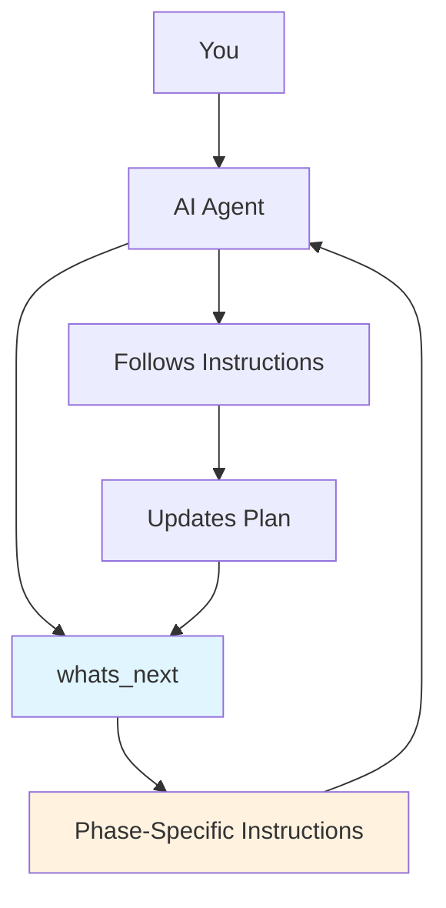

# How It Works

Most AI coding tools are like having a really fast intern – they'll do exactly what you ask, but they won't question whether you're asking for the right thing.

Responsible Vibe flips this around. Instead of your AI waiting for instructions, it actively guides the development process using proven engineering methodologies.

## The MCP Architecture



Here's the actual mechanics: Your AI agent calls **MCP tools** that return **phase-specific instructions**. It's prompt engineering, but contextual and systematic.

Most MCP tools return data. **Responsible Vibe tools return instructions** – side-effect free guidance on what to do next.

## Self-Documenting Tool System

Here's the clever part: MCP tools don't just return data – they expose **rich parameter descriptions** and **verbose errors** that teach the AI how to use the entire system.

**Real Example - `whats_next` Tool:**

```json
{
  "name": "whats_next",
  "description": "Get guidance for the current development phase and determine what to work on next. Call this tool after each user message to receive phase-specific instructions and check if you should transition to the next development phase. The tool will reference your plan file for specific tasks and context.",
  "parameters": {
    "context": "Brief description of what you're currently working on or discussing with the user",
    "user_input": "The user's most recent message or request",
    "conversation_summary": "Summary of the development progress and key decisions made so far"
  }
}
```

**What happens when called without starting development:**

```
Error: "No development conversation has been started for this project.
Please use the start_development tool first to initialize development with a workflow."

Suggestion: start_development({ workflow: "waterfall" })
Available workflows: ["waterfall", "epcc", "tdd", "bugfix", "greenfield", "minor"]
```

The AI learns the entire interaction pattern: **call `start_development` first**, **pick a workflow**, **then use `whats_next`** for guidance.

## The Core MCP Tools

### `whats_next()` - The Permanent Nudger

Called after every user interaction. Returns detailed instructions for what the AI should do next based on:

- Current development phase (requirements, design, implementation, etc.)
- Project context and conversation history
- Workflow methodology (waterfall, EPCC, TDD, bugfix)

**Example Response:**

```
"You are in the requirements phase. Ask the user about:
- Who will use this system?
- What are the key user stories?
- Are there any technical constraints?
Document findings in the plan file before proceeding."
```

### `start_development()` - The Kickoff

Initializes a new development workflow. The AI picks the right methodology based on your request:

- "Build a new app" → Greenfield workflow
- "Add a feature" → EPCC workflow
- "Fix this bug" → Bugfix workflow
- "I want to use TDD" → TDD workflow

### `proceed_to_phase()` - The Transitions

Moves between development phases when current phase tasks are complete. The AI checks entrance criteria before transitioning:

- Requirements complete? → Move to architecture
- Design approved? → Move to implementation
- Tests passing? → Move to deployment

### `setup_project_docs()` - The Memory

Creates persistent project documentation (architecture.md, requirements.md, design.md) that survives across conversations and branches.

## Phase-Specific Prompt Engineering

Each workflow phase has different instructions. Here's what your AI gets (simplified example based on the the waterfall-workflow):

**Requirements Phase:**

```
"Focus on understanding WHAT to build. Ask clarifying questions.
Don't discuss implementation details yet. Document requirements
in the plan file before moving forward."
```

**Architecture Phase:**

```
"Design the high-level system structure. Consider scalability,
maintainability, and integration points. Document architectural
decisions and create component diagrams."
```

**Implementation Phase:**

```
"Follow the design you created. Write clean, testable code.
Update the plan file with progress. Don't change architecture
without going back to design phase."
```

## Workflow Selection Magic

The AI automatically picks workflows based on context:

**Your Request**: "Build a todo app"  
**AI Thinks**: New project → Greenfield workflow → Full planning cycle

**Your Request**: "Add user authentication"  
**AI Thinks**: Existing codebase → EPCC workflow → Explore current code first

**Your Request**: "The login is broken"  
**AI Thinks**: Bug report → Bugfix workflow → Reproduce issue first

No configuration needed. The MCP tools analyze your request and return appropriate instructions.

## Long-Term Memory That Actually Works

Every conversation gets a unique ID based on your project path and git branch. This means:

- **Branch-specific development plans**: `development-plan-feature-auth.md` vs `development-plan-main.md`
- **Persistent project documentation**: Architecture decisions don't get lost
- **Context that survives**: Pick up exactly where you left off, even weeks later

## Universal MCP Compatibility

Because it's built on the Model Context Protocol, it works with any compatible agent. Today that's Amazon Q CLI, Claude Code, Gemini CLI, and OpenCode CLI. Tomorrow it'll work with whatever new tool launches.

You're not locked into a specific IDE or platform. The methodology travels with you.

## The Real Difference

Most AI tools make you faster at writing code. Responsible Vibe makes you better at engineering software.

There's a difference. And if you've ever spent a weekend refactoring something that could have been designed properly from the start, you know exactly what that difference is worth.

---

**Next**: [Quick Setup](./agent-setup.md) – Get your agent configured in 2 minutes
