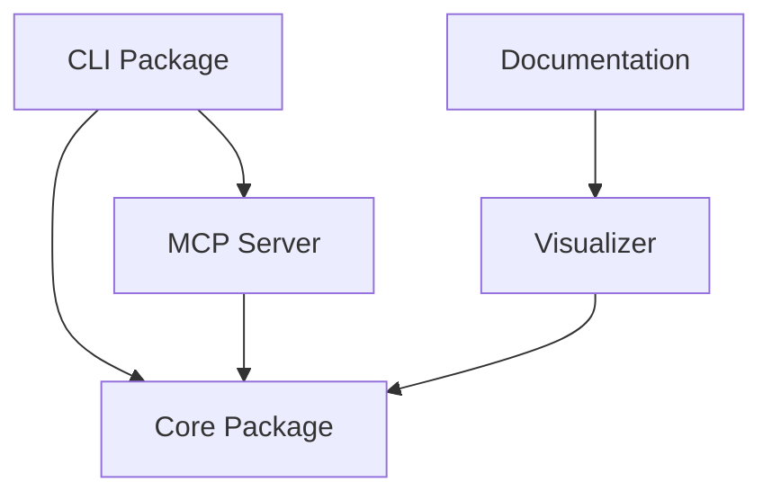
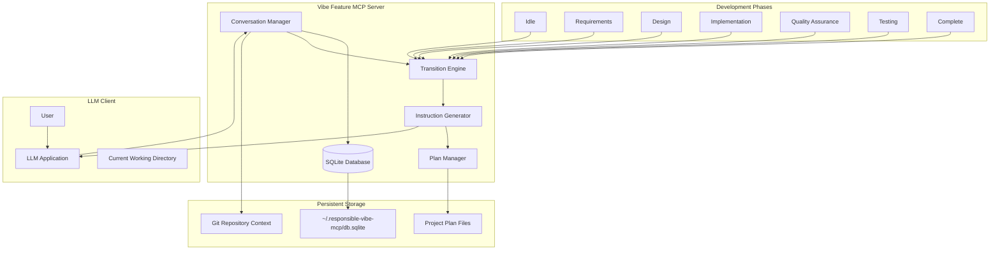
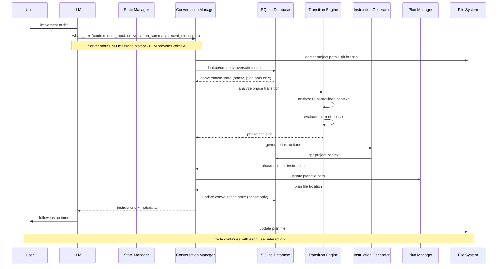

# Architecture

This document provides detailed information about the Responsible Vibe MCP Server architecture, components, and design principles.

## Information Architecture

Responsible-Vibe-MCP implements a **plan-file-centric information architecture** with clear separation of responsibilities across different components:

### Information Component Responsibilities

| **Component**         | **Responsibility**        | **Information Type**    | **Maintenance** |
| --------------------- | ------------------------- | ----------------------- | --------------- |
| **System Prompt**     | Generic workflow guidance | How to use the system   | Static          |
| **Tool Descriptions** | Generic tool usage        | What each tool does     | Static          |
| **Tool Responses**    | Dynamic phase guidance    | What to do right now    | Dynamic         |
| **Plan File**         | Project context & tasks   | What we've done/decided | LLM-maintained  |

### Core Principles

#### **1. Static Components Stay Generic**

- **System Prompt**: Workflow-agnostic instructions on tool usage patterns
- **Tool Descriptions**: Generic tool purposes without hardcoded phase names
- **Benefit**: Works with any workflow (built-in or custom)

#### **2. Dynamic Guidance Through Tool Responses**

- **Tool responses provide**: Phase-specific instructions, user interaction guidance, completion criteria
- **Plan-file-referential**: "Check your plan file's Design section for current tasks"
- **Context-aware**: Adapts to current project state and progress

#### **3. Plan File as Single Source of Truth**

- **Contains**: Task lists per phase, key decisions, project context
- **Structure**: Simple, LLM-maintainable (no complex dynamic elements)
- **Purpose**: Task tracker and decision log, not workflow guide

#### **4. Clear Separation of Concerns**

```
System Prompt: "How to use tools"
Tool Descriptions: "What tools do" (generic)
Tool Responses: "Check plan file section X, work on tasks Y, Z" (specific)
Plan File: "[ ] Task 1  [x] Task 2  Decision: chose approach A" (tracking)
```

### Benefits of This Architecture

- **✅ Workflow Flexibility**: Static components work with any workflow type
- **✅ Maintainable**: No hardcoded workflow information in static descriptions
- **✅ User Transparency**: Users see the same plan file the LLM follows
- **✅ Consistent Guidance**: All dynamic instructions come from tool responses
- **✅ Simple Maintenance**: LLM only updates simple task lists and decisions

## Monorepo Architecture

Responsible-Vibe-MCP is organized as a monorepo with clear package separation and dependency management:

### Package Structure

```
responsible-vibe-mcp/
├── packages/
│   ├── core/                    # @responsible-vibe/core
│   │   ├── src/                 # Core functionality (state machine, workflow management, database)
│   │   └── dist/                # Compiled TypeScript output
│   ├── mcp-server/              # @responsible-vibe/mcp-server
│   │   ├── src/                 # MCP server implementation and tool handlers
│   │   └── dist/                # Compiled server with bundled dependencies
│   ├── cli/                     # @responsible-vibe/cli
│   │   ├── src/                 # CLI tools and main entry point
│   │   └── dist/                # CLI executables
│   ├── visualizer/              # @responsible-vibe/visualizer
│   │   ├── src/                 # Vue.js workflow visualization component
│   │   └── dist/                # Built component for reuse
│   └── docs/                    # @responsible-vibe/docs
│       ├── .vitepress/          # VitePress documentation site
│       └── dev/                 # Developer documentation
├── resources/                   # Workflow definitions and templates
└── pnpm-workspace.yaml         # Monorepo configuration
```

### Package Dependencies



### Key Architectural Benefits

- **🔧 Separation of Concerns**: Each package has a single, well-defined responsibility
- **📦 Independent Deployment**: Packages can be built and tested independently
- **🔄 Workspace Dependencies**: Development uses workspace imports for type safety
- **📱 Dual Import Strategy**: Published packages use relative imports for Node.js compatibility
- **🎯 CLI as Main Entry**: CLI package serves as the main entry point, routing to MCP server or CLI functionality

### Build System

- **Turbo**: Orchestrates builds across packages with dependency awareness
- **TypeScript**: Shared configuration via `tsconfig.base.json`
- **PNPM Workspaces**: Efficient dependency management and linking
- **Independent Testing**: Each package can run its own test suite

### Publishing Strategy

The monorepo publishes as a single `responsible-vibe-mcp` package containing all built packages, maintaining backward compatibility while providing the benefits of modular development.

## Static Architecture



## Core Building Blocks

### 1. **Conversation Manager**

The Conversation Manager handles conversation identification, state persistence, and coordination between components.

**Responsibilities:**

- Generate unique conversation identifiers from project path + git branch
- Load and persist conversation state from/to database
- Coordinate state updates across components
- Handle conversation lifecycle (creation, updates, cleanup)
- Provide conversation-scoped state isolation
- Manage project-specific development context

**Key Features:**

- **Project-Aware Identification**: Uses absolute project path + current git branch as conversation identifier
- **Git Integration**: Automatically detects git branch changes and creates separate conversation contexts
- **Stateless Operation**: Does not store conversation history, relies on LLM-provided context
- **Multi-Project Support**: Handles multiple concurrent project conversations
- **State Validation**: Ensures state consistency and handles corrupted state recovery
- **Context Processing**: Analyzes LLM-provided conversation summary and recent messages

### 2. **Transition Engine**

The Transition Engine manages the development state machine and determines appropriate phase transitions.

**Responsibilities:**

- Analyze user input and conversation context
- Determine current development phase
- Evaluate phase completion criteria
- Trigger phase transitions based on conversation analysis
- Implement development state machine logic

**Key Features:**

- **Context Analysis**: Processes LLM-provided conversation summary and recent messages
- **Phase Detection**: Intelligently determines appropriate development phase
- **Transition Logic**: Implements rules for phase progression and regression
- **Completion Assessment**: Evaluates when phases are sufficiently complete
- **State Machine Management**: Handles the core development workflow logic

### 3. **Instruction Generator**

The Instruction Generator creates phase-specific guidance for the LLM based on current conversation state.

**Responsibilities:**

- Generate contextual instructions for each development phase
- Customize instructions based on project context and history
- Provide task completion guidance
- Generate plan file update instructions

**Key Features:**

- **Phase-Specific Guidance**: Tailored instructions for each development phase
- **Context-Aware Customization**: Adapts instructions based on project type and history
- **Task Management**: Provides clear guidance on task completion and progress tracking
- **Plan File Integration**: Ensures consistent plan file updates and maintenance

### 4. **Plan Manager**

The Plan Manager handles the creation, updating, and maintenance of project development plan files.

**Responsibilities:**

- Generate and maintain markdown plan files
- Track task completion and progress
- Manage plan file structure and content
- Handle plan file versioning per git branch

**Key Features:**

- **Markdown Generation**: Creates structured development plans in markdown format
- **Progress Tracking**: Maintains task completion status and project progress
- **Branch-Aware Plans**: Separate plan files for different git branches when needed
- **Template Management**: Consistent plan file structure across projects

### 5. **SQLite Database**

The database provides persistent storage for conversation state and metadata.

**Schema Design:**

- **conversation_states**: Core conversation metadata and current state
- **Indexes**: Optimized for project path + branch lookups

**Key Features:**

- **Persistent State**: Survives server restarts and system reboots
- **Multi-User Support**: Stored in user's home directory (~/.responsible-vibe-mcp/)
- **Lightweight Storage**: Minimal overhead for state management
- **Atomic Updates**: Ensures data consistency during concurrent operations

## Dynamic Behavior



## Data Flow Architecture

### 1. **Conversation Identification Flow**

```
User Input → Project Detection → Git Branch Detection → Conversation ID Generation → Database Lookup
```

### 2. **State Management Flow**

```
Conversation ID → State Retrieval → Context Analysis → Phase Determination → State Update → Persistence
```

### 3. **Instruction Generation Flow**

```
Current Phase → Project Context → Conversation History → Instruction Template → Customized Instructions
```

### 4. **Plan File Management Flow**

```
Project Path → Branch Detection → Plan File Path → Content Generation → File Updates → Progress Tracking
```

## Key Architectural Principles

### 1. **Project-Centric Design**

- Each project maintains independent conversation state
- Git branch awareness enables feature-specific development tracking
- Plan files remain within project directories for easy access

### 2. **Persistent State Management**

- SQLite database ensures state survives server restarts
- Conversation history enables context-aware decision making
- Database stored in user home directory for portability

### 3. **Phase-Driven Workflow**

- Clear separation between development phases
- Phase-specific instructions guide LLM behavior
- Transition logic ensures appropriate workflow progression

### 4. **Conversation Continuity**

- Long-term memory across multiple LLM interactions
- Context preservation enables complex, multi-session development
- History tracking supports learning and improvement

### 5. **Git Integration**

- Branch-aware conversation management
- Separate development contexts for different features
- Integration with existing git workflows

### 6. **Flexible Documentation Architecture**

- **Optional Documentation**: Workflows can specify whether formal documentation is required
- **Conditional References**: Workflows adapt instructions based on document availability
- **Workflow-Specific Requirements**: `requiresDocumentation` metadata flag controls documentation enforcement
- **Backward Compatibility**: Existing workflows default to optional documentation

## Optional Documentation Architecture

The system supports flexible documentation requirements to accommodate both comprehensive and lightweight development approaches:

### Documentation Requirement Levels

| **Workflow Type** | **requiresDocumentation** | **Behavior**                                       | **Examples**                       |
| ----------------- | ------------------------- | -------------------------------------------------- | ---------------------------------- |
| **Comprehensive** | `true`                    | Documentation setup required before workflow start | greenfield, waterfall, c4-analysis |
| **Lightweight**   | `false` (default)         | Skip documentation setup, proceed directly         | epcc, minor, bugfix                |

## Scalability Considerations

### 1. **Multi-Project Support**

- Concurrent handling of multiple project conversations
- Isolated state prevents cross-project interference
- Efficient database indexing for fast project lookups

### 2. **Performance Optimization**

- SQLite provides fast local storage with minimal overhead
- Conversation state caching reduces database queries
- Efficient git branch detection minimizes system calls

### 3. **Storage Management**

- Automatic cleanup of old conversation states
- Plan file management within project boundaries
- Database maintenance and optimization capabilities

## Integration Points

### 1. **LLM Integration**

- Single `whats_next` tool interface
- JSON-based instruction delivery
- Context-aware response generation

### 2. **File System Integration**

- Plan file creation and management
- Project directory detection
- Git repository integration

### 3. **Development Tool Integration**

- Compatible with existing development workflows
- Non-intrusive plan file placement
- Standard markdown format for universal compatibility

## State Machine

The server operates as a state machine that transitions between development phases. While workflows typically follow a linear progression, **users can transition directly to any phase at any time** using the `proceed_to_phase` tool.

For a comprehensive reference of all state transitions, including detailed instructions and transition reasons, see [TRANSITIONS.md](./TRANSITIONS.md).

## Logging and Debugging

The server includes comprehensive logging with configurable levels for debugging, monitoring, and troubleshooting:

### Log Levels

- **DEBUG**: Detailed tracing and execution flow
- **INFO**: Success operations and important milestones (default)
- **WARN**: Expected errors and recoverable issues
- **ERROR**: Caught but unexpected errors

### Configuration

Set the log level using the `LOG_LEVEL` environment variable:

```bash
# Debug level (most verbose)
LOG_LEVEL=DEBUG npx tsx src/index.ts

# Production level
LOG_LEVEL=INFO node dist/index.js
```

### Log Components

- **Server**: Main server operations and tool handlers
- **Database**: SQLite operations and state persistence
- **ConversationManager**: Conversation context management
- **TransitionEngine**: Phase transition analysis
- **PlanManager**: Plan file operations

For detailed logging documentation, see [LOGGING.md](./LOGGING.md).

## Interaction Logging

Vibe Feature MCP includes a comprehensive interaction logging system that records all tool calls and responses for debugging and analysis purposes:

### Logged Information

- **Tool Calls**: All calls to `whats_next` and `proceed_to_phase` tools
- **Input Parameters**: Complete request parameters for each tool call
- **Response Data**: Complete response data returned to the LLM
- **Current Phase**: Development phase at the time of the interaction
- **Timestamp**: When the interaction occurred
- **Conversation ID**: Which conversation the interaction belongs to

### Data Storage

All interaction logs are stored in the local SQLite database in the `.vibe` directory of your project. The data is stored without masking or filtering, as it is kept locally on your system.

### Querying Logs

Logs can be queried by conversation ID for analysis and debugging purposes. No UI is provided in the current implementation, but the database can be accessed directly using SQLite tools.

**Note**: All interaction data is stored locally on your system and is never transmitted to external services.
